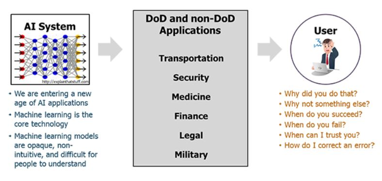
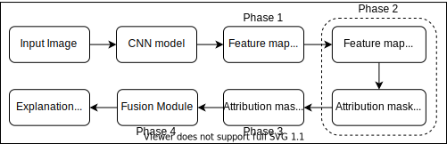
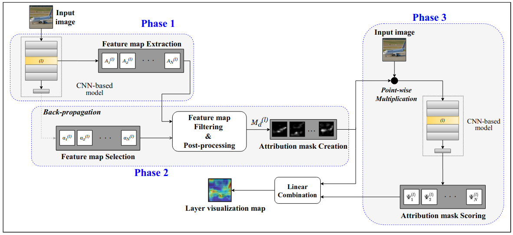
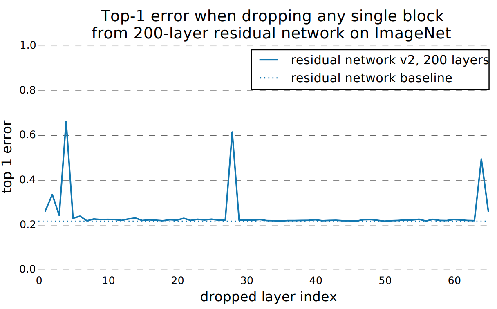

```
TL;DR

* We propose a state-of-the-art post-hoc CNN specific Visual XAI algorithm - SISE.
* Input      :  A test image; The trained model
* Output     :  A visual 2D heatmap 
* Properties :  Noise-free, High resolution, Class discriminative and Correlates 
                to model's prediction.
```

---
**Please find an updated article about our XAI algorithm (SISE) written by LG AI Research [here](https://www.lgresearch.ai/blog/view/?seq=67) (English) or [here](https://m.post.naver.com/viewer/postView.nhn?volumeNo=30627518&memberNo=52249799) (Korean).**

---

# Need for XAI

Deep Neural models based on Convolutional Neural Networks (CNNs) have rendered inspiring breakthroughs in a wide variety of computer vision tasks. However, *the lack of interpretability* hurdles the understanding of decisions made by these models. This diminishes the trust consumers have for CNNs and limits the interactions between users and systems established based on such models.

<p align="center">
    
    <br>
    <em>Fig. 1: The Need of Explainable AI (XAI). <a href="https://www.darpa.mil/program/explainable-artificial-intelligence" target="_blank">Source</a></em>
</p>

Explainable AI (XAI) attempts to interpret such cumbersome models. The offered interpretation ability has put XAI in the center of interest in various fields, especially where any single false prediction can cause severe consequences (e.g. healthcare) or where regulations force automotive decision-making systems to provide users with explanations (e.g. criminal justice) [1]. 

**Types of XAI**

The two main classifications of XAI methods are,
1. *Ad-hoc*: Explaining how the model learns in the Training phase.
2. *Post-hoc (Ante-hoc)*: Explaining how the model makes its decisions in the Evaluation phase.

Our work particularly addresses the problem of Visual Explanation for images, which is a branch of post-hoc XAI. This field aims to visualize the behavior of models trained for image recognition tasks [2]. The outcome of the methods in this sub-field is a *heatmap* in the same size as the input image named **“explanation map”** that represents the evidence leading the model to make a decision.

# Contribution

We introduce a novel XAI algorithm that we presented at the 35th AAAI Conference on Artificial Intelligence (**AAAI-21**), which offers both **spatial resolution** and **explanation completeness** in its output explanation map by 
1. using multiple layers from the “intermediate blocks” of the target CNN,
2. selecting crucial feature maps from the outputs of the layers,
3. employing an attribution-based technique for input sampling to visualize the perspective of each layer, and 
4. applying a feature aggregation step to reach refined explanation maps.

Our proposed algorithm is motivated by ‘perturbation-based’ XAI methods that attempt to interpret the model’s prediction by employing input sampling techniques. These methods have shown a great faithfulness in rationally inferring the predictions of models. However, they show instability as their output depends on random sampling (RISE) [3] or random initialization for optimizing a perturbation mask (Extremal perturbation) [4]. They also produce different explanation maps each time and have an excessive runtime when attempting to get generalized results.

To address such limitations while enhancing their strength, we propose a *CNN-specific algorithm* that improves their fidelity and plausibility (in the view of reasoning) with adaptive runtime for practical usage. We term our algorithm as **Semantic Input Sampling for Explanation (SISE)**. To claim such a reform, we replace the randomized input sampling technique in RISE with a sampling technique that relies on the feature maps derived from various layers of the model. We call this procedure *attribution-based input sampling* and we show that it provides a high-resolution perspective of the model in multiple semantic levels, in turn with restricting the applicability of SISE to CNNs.

# Methodology

<p align="center">
    
    <br>
    <em>Fig. 2: Global overview of the Proposed framework</em>
</p>

As sketched in Fig. 2, SISE consists of **four phases**. In the `first phase`, multiple layers of the model are selected and a set of corresponding output feature maps are extracted. In the `second phase`, for each set of feature maps, a subset containing the most important feature maps are sampled with a backward pass. 

<p align="center">
    
    <br>
    <em>Fig. 3: Schematic of SISE's layer visualization framework (first three phases). The procedure in this framework is applied to multiple layers and is followed by the fusion framework (as in Fig. 6)</em>
</p>

The selected feature maps are then post-processed to create sets of perturbation masks to be utilized in the `third phase` for attribution-based input sampling and are termed as *attribution masks*. These procedures in the first three phases are applied to the last layers of each convolutional block in the network, and their output is a 2-dimensional saliency map named *visualization map*. The details of this method are depicted in the schematic figure (Fig. 3) and our intuition for the layer selection policy is discussed more analytically below. Such obtained visualization maps are aggregated in the `last phase` to reach the final explanation map.

**Attribution-Based Input Sampling**

Assume $\Psi:\mathcal{I}\rightarrow\mathbb{R}$ be a trained model that outputs a confidence score for a given input image, where $\mathcal{I}$ is the space of RGB images $\mathcal{I}=\{I|I:\Lambda\rightarrow\mathbb{R}^{3}\}$, and $\Lambda=\{1,...,H\} \times \{1,...,W\}$ is the set of locations (pixels) in the image. 

Given any model and image, the goal of an explanation algorithm is to reach a unified explanation map $S_{I,\Psi}(\lambda)$, that assigns an "importance value" to each location in the image $(\lambda \in \Lambda)$. The explanation maps are represented as $$S_{I,\Psi}(\lambda)=\mathbb{E}_{M} [\Psi(I\odot m)\cdot C_{m}(\lambda)]$$

where the term $C_{m}(\lambda)$ indicates the contribution amount of each pixel in the masked image and it is defined as $$C_{m}(\lambda)=\frac{m(\lambda)}{\sum_{\lambda\in\Lambda}m(\lambda)}$$

Here, it can be noted that we normalize them according to the size of perturbation masks to decrease the assigned reward to the background pixels when a high score is reached for a mask with too many activated pixels.

**Feature Map Selection**

Let $l$ be a selected layer containing $N$ feature maps that are 2-dimensional matrices represented as $A_{k}^{(l)} (k=\{1,...,N\})$. 

To identify and reject the class-indiscriminative feature maps, we partially backpropagate the signal to the selected layer to score the gradient of model's confidence score to each of the feature maps. These gradient scores are represented as follows:

$$\alpha_k^{(l)} = \sum_{\lambda^{(l)} \in \Lambda^{(l)}} \frac{\partial \Psi(I)}{\partial A_{k}^{(l)} (\lambda^{(l)})}$$

$$\beta^{(l)} = \max_{k\in \{1,...,N\}} ( \alpha_k^{(l)})$$

The feature maps with corresponding non-positive gradient scores ($\alpha_k^{(l)}$), tend to contain features related to other classes rather than the class of interest. Terming such feature maps as `negative-gradient`, we define the set of **attribution masks** obtained from the `positive-gradient` feature maps, $M_d^{(l)}$, as:

$$M_d^{(l)}=\{ \Omega(A_{k}^{(l)})|k\in \{1,...,N\}, \alpha_k^{(l)}<\mu \times \beta^{(l)} \}$$

where $\mu$ is a parameter that is **0 by default** to discard negative-gradient feature maps while retaining only the positive-gradients.

A visual comparison of such created attribution masks in our approach with random masks in Fig. 4 emphasizes such advantages discussed.

<p align="center">
    
    <br>
    <em>Fig. 4: Qualitative comparison of (a) attribution masks derived from different blocks of a VGG16 network as in SISE, with (b) random masks employed in RISE.</em>
</p>

**Layer Selection**

As SISE extracts the feature maps from multiple layers in its first phase, we here define the most crucial layers for explicating the model's decisions. The intention is to reach a complete understanding of the model by visualizing the minimum number of layers.

We study a simulation experiment as in “Veit et al.” [5], where the corresponding test errors are reported for removing a layer individually from a residual network. It was observed as in Fig. 5 that removing convolutional layers individually does not affect the network, while a *significant degradation* in test performance is recorded only when the **pooling layers** are removed.

<p align="center">
    
    <br>
    <em>Fig. 5: Screenshot of simulation results from [5] claiming that the importance of downsampling layers.
</em>
</p>

Based on this hypothesis and result, most of the data in each model can be collected by probing the pooling layers. Thus, by visualizing these layers, it is possible to track the way features are propagated through convolutional blocks. Therefore, for all given CNNs, we select the inputs of the pooling layers to be visualized in the first three phases of SISE and pass their corresponding visualization maps to the fusion block to perform a *block-wise feature aggregation*.

**Fusion Block**

<p align="center">
    
    <br>
    <em>Fig. 6: The proposed fusion framework for a CNN with 5 convolutional blocks.</em>
</p>

The proposed fusion module is designed with **cascaded fusion blocks**. In each fusion block, the feature information from the visualization maps representing explanations for two consecutive blocks is collected using an "addition" block. Then, the features that are absent in the latter visualization map are removed from the collective information by masking the output of the addition block with a binary mask indicating the activated regions in the latter visualization map. To reach the binary mask, we apply an adaptive threshold to the latter visualization map, determined by Otsu's method [6]. By cascading fusion blocks as in Fig. 6, the features determining the model's prediction are represented in a more fine-grained manner while the inexplicit features are discarded.

# Experiments

We verify the performance of our method on shallow and deep CNNs, including VGG16 and ResNet-50 architectures. To conduct the corresponding experiments, we employed **PASCAL VOC 2007** [7] and **MS COCO 2014** [8] datasets, and the experiments are evaluated on their test set with pre-trained models from the TorchRay library [9].

**Quantitative Results**

Quantitative analysis includes evaluation results categorized into *ground truth-based* and *model truth-based* metrics. The former is used to justify the model by assessing the extent to which the algorithm satisfies the users by providing visually superior explanations, while the latter is used to analyze the model behavior by assessing the faithfulness of the algorithm and its correctness in capturing the attributions in line with the model's prediction procedure. Refer to our [preprint paper](https://arxiv.org/pdf/2010.00672.pdf) to know more about the metrics employed.

The evaluation results are shown in Tables 1 and 2 below which indicates the superior ability of SISE in providing satisfying, high-resolution, and complete explanation maps that provide a precise visual analysis of the model’s predictions and perspective. For each metric, the best is shown in **bold**.  Except for Drop%, the higher is better for all other metrics. 


|     Model     |   Metric  |  Grad-CAM | Grad-CAM++ | Extremal  Perturbation |  RISE | Score-CAM | Integrated Gradient | FullGrad |    SISE   |
|:-------------:|:---------:|:---------:|:----------:|:----------------------:|:-----:|:---------:|:-------------------:|:--------:|:---------:|
|   **VGG16**   |    EBPG   |   55.44   |    46.29   |        **61.19**       | 33.44 |   46.42   |        36.87        |   38.72  |   60.54   |
|               |    mIoU   |   26.52   |  **28.1**  |          25.44         | 27.11 |   27.71   |        14.11        |   26.61  |   27.79   |
|               |    Bbox   |    51.7   |    55.59   |          51.2          | 54.59 |   54.98   |        33.97        |   54.17  | **55.68** |
|               |   Drop%   |   49.47   |    60.63   |          43.90         | 39.62 |   39.79   |        64.74        |   60.78  | **38.40** |
|               | Increase% |   31.08   |    23.89   |          32.65         | 37.76 |   36.42   |        26.17        |   22.73  | **37.96** |
| **ResNet-50** |    EBPG   |   60.08   |    47.78   |          63.24         | 32.86 |   35.56   |        40.62        |   39.55  | **66.08** |
|               |    mIoU   | **32.16** |    30.16   |          26.29         |  27.4 |    31.0   |        15.41        |   20.2   |   31.37   |
|               |    Bbox   |   60.25   |    58.66   |          52.34         | 55.55 |   60.02   |        34.79        |   44.94  | **61.59** |
|               |   Drop%   |   35.80   |    41.77   |          39.38         | 39.77 |   35.36   |        66.12        |   65.99  | **30.92** |
|               | Increase% |   36.58   |    32.15   |          34.27         | 37.08 |   37.08   |        24.24        |   25.36  | **40.22** |

*Table 1: Results of ground truth-based and model truth-based metrics for state-of-the-art XAI methods along with SISE (proposed) on two networks (VGG16 and ResNet-50) trained on PASCAL VOC 2007 dataset.* 

|     Model     |   Metric  |  Grad-CAM | Grad-CAM++ | Extremal Perturbation |  RISE | Score- CAM | Integrated Gradient | FullGrad |    SISE   |
|:-------------:|:---------:|:---------:|:----------:|:---------------------:|:-----:|:----------:|:-------------------:|:--------:|:---------:|
|   **VGG16**   |    EBPG   |   23.77   |    18.11   |         25.71         |  11.5 |    12.59   |        14.01        |   13.96  | **28.16** |
|               |    mIoU   |   15.04   |  **15.69** |         12.81         | 14.94 |    15.52   |         7.13        |   14.25  |   15.57   |
|               |    Bbox   |   28.98   |    20.48   |         24.93         |  28.9 |    27.8    |        14.54        |   27.52  | **29.63** |
|               |   Drop%   |   44.46   |    45.63   |         41.86         | 38.69 |    33.73   |        52.73        |   52.39  |  **32.9** |
|               | Increase% |   40.28   |    38.33   |         41.30         | 46.05 |    49.26   |        34.11        |   32.68  | **50.56** |
| **ResNet-50** |    EBPG   |    25.3   |    17.81   |         27.54         | 11.35 |    12.6    |        14.41        |   14.39  | **29.43** |
|               |    mIoU   | **17.89** |    15.8    |         13.61         | 14.69 |    16.36   |         7.24        |   10.14  |   17.03   |
|               |    Bbox   |   32.39   |    28.28   |         26.98         | 29.43 |    29.27   |        14.54        |   19.32  | **33.34** |
|               |   Drop%   |   33.42   |    41.71   |         36.24         | 37.93 |    35.06   |        55.38        |   56.83  | **31.41** |
|               | Increase% |   48.39   |    40.54   |         45.74         | 45.44 |    47.25   |        32.18        |   29.59  | **49.76** |

*Table 2: Results of the state-of-the-art XAI methods compared with SISE on two networks (VGG16 and ResNet-50) trained on MS COCO 2014 dataset.*

**Qualitative Results**

Based on explanation quality, we have compared SISE with other state-of-the-art methods on sample images from the Pascal dataset in Fig. 7 and MS COCO dataset in Fig. 8. Images with both normal-sized and small object instances are shown along with their corresponding confidence scores. 

<p align="center">
    
    <br>
    <em>Fig. 7: Qualitative comparison of SISE with other state-of-the-art XAI methods with a ResNet-50 model on the Pascal VOC 2007 dataset.</em>
</p>

<p align="center">
    
    <br>
    <em>Fig. 8: Explanations of SISE along with other conventional methods from a VGG16 model on the MS COCO 2014 dataset.</em>
</p>

# Conclusion

* In this work we proposed SISE, a novel Visual XAI method well-performed on both shallow and deep CNNs.
* By taking efficient perturbation techniques into account, we were able to improve the preciseness of the obtained explanation map.
* Also, by employing backpropagation techniques, we were able to reduce the complexity of our method, while retaining the performance.
* By applying the proposed simple block-wise feature aggregation, the visual resolution of our method has been enhanced, and low-level and mid-level features in the mode have been represented as well as high-level ones.
* Ground truth-based metrics are utilized for proving the superior visual quality of our method.
* Model truth-based metrics also used along with the sanity checks to verify the performance of SISE in investigating the behavior of the models accurately.

---
**More resources like Poster, Slides, Video and PDF are available [here](https://msudhakar.com/publication/sise/).**

---
**All figures and content published here are owned by the authors at the Multimedia Laboratory at the University of Toronto and the LG AI Research.**

---

# Cite 
Consider citing our work as below, if you find it useful in your research:
```
@article{Sattarzadeh_Sudhakar, 
  title={Explaining Convolutional Neural Networks through Attribution-Based Input Sampling and Block-Wise Feature Aggregation}, 
  volume={35}, 
  url={https://ojs.aaai.org/index.php/AAAI/article/view/17384}, 
  number={13}, 
  journal={Proceedings of the AAAI Conference on Artificial Intelligence}, 
  author={Sattarzadeh, Sam and Sudhakar, Mahesh and Lem, Anthony and Mehryar, Shervin and Plataniotis, Konstantinos N and Jang, Jongseong and Kim, Hyunwoo and Jeong, Yeonjeong and Lee, Sangmin and Bae, Kyunghoon}, 
  year={2021}, 
  month={May}, 
  pages={11639-11647} 
}

```

# References
[1]. Lipton, Z. C. 2016. The Mythos of Model Interpretability. CoRR abs/1606.03490. URL http://arxiv.org/abs/1606.03490.

[2]. Barredo Arrieta, A.; Diaz Rodriguez, N.; Del Ser, J.; Bennetot, A.; Tabik, S.; Barbado Gonzalez, A.; Garcia, S.; Gil-Lopez, S.; Molina, D.; Benjamins, V. R.; Chatila, R.; and Herrera, F. 2019. Explainable Artificial Intelligence (XAI): Concepts, Taxonomies, Opportunities and Challenges toward Responsible AI. Information Fusion doi:10.1016/j.inffus.2019.12.012.

[3]. Petsiuk, V., Das, A. and Saenko, K., 2018. Rise: Randomized input sampling for explanation of black-box models. arXiv preprint arXiv:1806.07421.

[4]. Fong, R., Patrick, M. and Vedaldi, A., 2019. Understanding deep networks via extremal perturbations and smooth masks. In Proceedings of the IEEE International Conference on Computer Vision (pp. 2950-2958).

[5]. Veit, A., Wilber, M.J. and Belongie, S., 2016. Residual networks behave like ensembles of relatively shallow networks. In Advances in neural information processing systems (pp. 550-558).

[6]. N. Otsu, "A Threshold Selection Method from Gray-Level Histograms," in IEEE Transactions on Systems, Man, and Cybernetics, vol. 9, no. 1, pp. 62-66, Jan. 1979, doi: 10.1109/TSMC.1979.4310076.

[7]. Everingham, M.; Van Gool, L.; Williams, C. K. I.; Winn, J.; and Zisserman, A. 2007. The PASCAL Visual Object Classes Challenge 2007 (VOC2007) Results. URL http://www.pascal-network.org/challenges/VOC/voc2007/workshop/index.html.

[8]. Lin, T.; Maire, M.; Belongie, S. J.; Bourdev, L. D.; Girshick, R. B.; Hays, J.; Perona, P.; Ramanan, D.; Dollar, P.; and Zit-nick, C. L. 2014. Microsoft COCO: Common objects in context. arXiv 2014. arXiv preprint arXiv:1405.0312 .

[9]. Fong, R.; Patrick, M.; and Vedaldi, A. 2019. Understanding deep networks via extremal perturbations and smooth masks. In Proceedings of the IEEE International Conference on Computer Vision, 2950–2958.

---