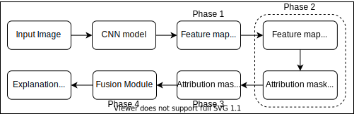

+++
title = "Explaining Convolutional Neural Networks through Attribution-Based Input Sampling and Block-Wise Feature Aggregation"
date = 2020-10-01T16:00:00
draft = false

authors = ["Sam Sattarzadeh", "Mahesh Sudhakar", "Anthony Lem", "Shervin Mehryar", "K. N. Plataniotis", "Jongseong Jang", "Hyunwoo Kim", "Yeonjeong Jeong", "Sangmin Lee", "Kyunghoon Bae"]

# Publication type.
# Legend:

publication_types = ["1"]

# Abstract and optional shortened version.
abstract = "As an emerging field in Machine Learning, Explainable AI (XAI) has been offering remarkable performance in interpreting the decisions made by Convolutional Neural Networks (CNNs). To achieve visual explanations for CNNs, methods based on class activation mapping and randomized input sampling have gained great popularity. However, the attribution methods based on these techniques provide lower-resolution and blurry explanation maps that limit their explanation power. To circumvent this issue, visualization based on various layers is sought. In this work, we collect visualization maps from multiple layers of the model based on an attribution-based input sampling technique and aggregate them to reach a fine-grained and complete explanation. We also propose a layer selection strategy that applies to the whole family of CNN-based models, based on which our extraction framework is applied to visualize the last layers of each convolutional block of the model. Moreover, we perform an empirical analysis of the efficacy of derived lower-level information to enhance the represented attributions. Comprehensive experiments conducted on shallow and deep models trained on natural and industrial datasets, using both ground-truth and model-truth based evaluation metrics validate our proposed algorithm by meeting or outperforming the state-of-the-art methods in terms of explanation ability and visual quality, demonstrating that our method shows stability regardless of the size of objects or instances to be explained."

abstract_short = "A novel eXplanation AI (XAI) algorithm to analyze CNN based ML models."

# Is this a featured publication? (true/false)
featured = true

# Projects (optional).
projects = ""
categories = ""
tags = "XAI"

# Slides (optional).
#   Associate this publication with Markdown slides.
#   Simply enter your slide deck's filename without extension.
#   E.g. `slides = "example-slides"` references 
#   `content/slides/example-slides.md`.
#   Otherwise, set `slides = ""`.
slides = ""

# https://arxiv.org/pdf/2010.00672.pdf
# Links (optional).
url_preprint = "https://arxiv.org/abs/2010.00672"
url_code = ""
url_dataset = ""
url_project = "https://www.utoronto.ca/news/researchers-u-t-and-lg-develop-explainable-artificial-intelligence-algorithm"
url_slides = "docs/SISE_AAAI_ppt.pdf"
url_pdf = "https://ojs.aaai.org/index.php/AAAI/article/view/17384"
url_video = "https://studio.slideslive.com/web_recorder/share/20210108T221249Z__AAAI__7570__explaining-convolutional-neura?s=f048878d-49a9-45b6-9957-b8174d9f56e1"
url_poster = "docs/SISE_AAAI_Poster.pdf"
url_source = ""

# Custom links (optional).
#   Uncomment line below to enable. For multiple links, use the form `[{...}, {...}, {...}]`.
# url_custom = [{name = "Github Repo", url = "https://github.com/antaldaniel/eurobarometer/"}]

# Digital Object Identifier (DOI)
doi = ""

# Does this page contain LaTeX math? (true/false)
math = true

# Featured image
[image]
  # Caption (optional)
  caption = "Global overview of the Proposed framework - SISE"

  # Focal point (optional)
  # Options: Smart, Center, TopLeft, Top, TopRight, Left, Right, BottomLeft, Bottom, BottomRight
  focal_point = "Center"
+++

# Overview

A global overview of our proposed framework for SISE describing the multiple phases is attached in the figure below. To know more about each phase in detail along with a summary of our algorithm, please read the [technical blog post](https://smahesh2694.github.io/sise_webpage/sise_blog).

<p align="center">
    
    <br>
    <em>Fig: Global overview of the Proposed framework</em>
</p>

# Results

A sample qualitative comparison of the explanation maps generated from our algorithm to other conventional methods can be seen below. To view more qualitative results, please see our [preprint paper](https://arxiv.org/pdf/2010.00672.pdf).

<p align="center">
    
    <br>
    <em>Fig: Comparison of other existing XAI methods with SISE (last column) to demonstrate SISE’s ability to generate class discriminative explanations on a ResNet-50 model.</em>
</p>

# Cite 
Consider citing our work as below, if you find it useful in your research:
```
@article{Sattarzadeh_Sudhakar, 
title={Explaining Convolutional Neural Networks through Attribution-Based Input    Sampling and Block-Wise Feature Aggregation}, 
volume={35}, 
url={https://ojs.aaai.org/index.php/AAAI/article/view/17384}, 
number={13}, 
journal={Proceedings of the AAAI Conference on Artificial Intelligence}, 
author={Sattarzadeh, Sam and Sudhakar, Mahesh and Lem, Anthony and Mehryar, Shervin and Plataniotis, Konstantinos N and Jang, Jongseong and Kim, Hyunwoo and Jeong, Yeonjeong and Lee, Sangmin and Bae, Kyunghoon}, 
year={2021}, 
month={May}, 
pages={11639-11647} }

```

---

Our paper has been published virtually at the 35th AAAI Conference on Artificial Intelligence (**AAAI-21**).

**All figures and content published here are owned by the authors at the Multimedia Laboratory at the University of Toronto and LG AI Research**
